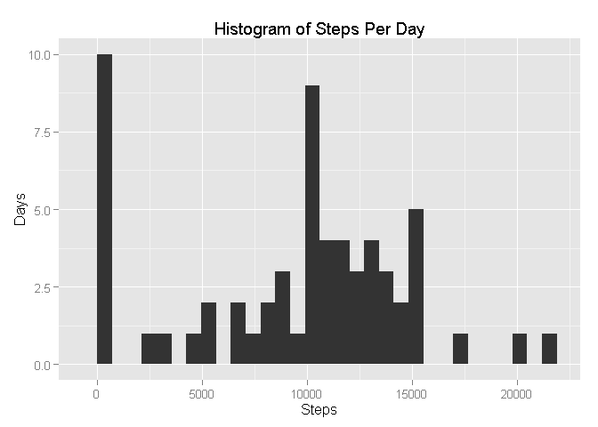
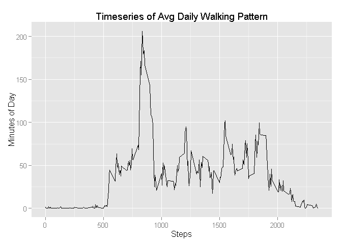
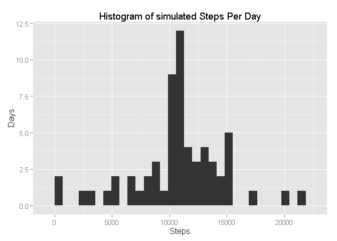
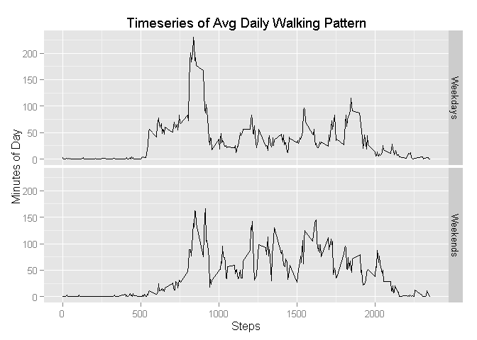

# Reproducible Research: Peer Assessment 1


## Loading and preprocessing the data
First, we load the packages and data for the analysis:

```r
library(ggplot2)
setwd("..")
setwd("RepData_PeerAssessment1")

z <- "activity.zip"
c <- "activity.csv"
if(!file.exists(c)){
        unzip(z)
}

d <- read.csv(c)
```

## What is mean total number of steps taken per day?
Second, we create a vector summarizing average (mean) steps per day, and use it to create a histogram of steps per day.

```r
dStepsPerDay <- tapply(d$steps, d$date, sum, na.rm = TRUE, simplify = TRUE)
qplot(dStepsPerDay, main = 'Histogram of Steps Per Day', ylab = 'Days', xlab = "Steps")
```

```
## stat_bin: binwidth defaulted to range/30. Use 'binwidth = x' to adjust this.
```

 
  
Third, we calculate the overall mean and median number of steps per day over the entire measurement period.

```r
mean(dStepsPerDay); median(dStepsPerDay)
```

```
## [1] 9354.23
```

```
## [1] 10395
```
## What is the average daily activity pattern?
Fourth, we create a time series plot showing the average number of steps the person takes during each 5 minute interval of the day.

```r
ts <- aggregate(list(steps = d$steps), by = list(intervals = d$interval), FUN = mean, na.rm = TRUE)
ggplot(ts, aes(x = intervals, y = steps)) + geom_line() + labs(title = "Timeseries of Avg Daily Walking Pattern", y = "Minutes of Day", x = "Steps")
```

 
    
The following code chunk returns the 5 minute period with the highest average (mean) steps.


```r
ts$interval[ts$steps == max(ts$steps)]
```

```
## [1] 835
```

## Imputing missing values
This code reveals the number of rows containing NA values, then breaks down number of NAs by column.

```r
sum(!complete.cases(d))
```

```
## [1] 2304
```

```r
sum(!complete.cases(d$steps))
```

```
## [1] 2304
```

```r
sum(!complete.cases(d$date))
```

```
## [1] 0
```

```r
sum(!complete.cases(d$interval))
```

```
## [1] 0
```
  
As you can see, the only column with NA values is steps. We will use the code below to create a simulation of the original data. The simulated data will be the same as the original, except it will fill the NA values with the average (mean) steps per interval shown in the timeseries chart above.


```r
##This function will be used to fill NAs.
fillFunction <- function(stps, intv){
        if(!is.na(stps)){
                stps
        }else{
                ts[ts$intervals == intv, 2]
        }
}

dd <- d
estSteps <- mapply(fillFunction, dd$steps, dd$interval)
dd[, "steps"] <- transform(dd, steps = estSteps)
```

```
## Warning in `[<-.data.frame`(`*tmp*`, , "steps", value =
## structure(list(steps = c(1.71698113207547, : provided 3 variables to
## replace 1 variables
```
    
We can now use our simulated & filled dataset to create a histogram and calculate the mean and median and evaluate the diffrances between both data sets.


```r
##Plot clonded data set and calculate its mean & median.
ddStepsPerDay <- tapply(dd$steps, dd$date, sum, na.rm = TRUE, simplify = TRUE)
qplot(ddStepsPerDay, main = 'Histogram of simulated Steps Per Day', ylab = 'Days', xlab = "Steps")
```

```
## stat_bin: binwidth defaulted to range/30. Use 'binwidth = x' to adjust this.
```

 

```r
mean(ddStepsPerDay); median(ddStepsPerDay)
```

```
## [1] 10766.19
```

```
## [1] 10766.19
```

```r
##Set variables containing both data sets' means and medians
dMean <- mean(dStepsPerDay)
dMedian <- median(dStepsPerDay)
ddMean <- mean(ddStepsPerDay)
ddMedian <- median(ddStepsPerDay)


##Calculate the absolute and percent change between the two data sets' means and medians:
meanChange <- ddMean - dMean
medianChange <- ddMedian - ddMedian

meanChangeP <- ((ddMean - dMean) / dMean) * 100
medianChangeP <- ((ddMedian - dMedian) / dMedian) * 100
```

After filling in the NAs, the mean moved from 9354.2295082 to  1.0766189\times 10^{4} (a change of 1411.959171 steps, or 15.0943396%).  
    
The median moved from 10395 to  1.0766189\times 10^{4} (a change of steps 0, or 3.5708387%).

The mean and median are both higher after filling missing values. The results from the fact that in the unaltered data, we ignored NA values. That is to say, when we used tapply to sum the total steps, each 5-second interval with NA was counted as an interval with zero steps. But in the simulated data set, we filled each NA with a number >= zero, so many of the NAs were replaced with step counts that would have been added to the daily total when summing with tapply.

## Are there differences in activity patterns between weekdays and weekends?
Finally, lets compare the time series of avg steps through out the day on weekdays vs weekends and see what diffrances we find.


```r
##Convert dates to POSIxt format.
dd <- transform(dd, date = strptime(dd$date, "%Y-%m-%d"))

##Create vector indicating the name of the day corresponding to each date.
ddDays <- weekdays(dd$date)

##create function to use to convert days to weekend v weekday factor.
convtFun <- function(x){
        if(x %in% c("Saturday", "Sunday")){
                c("Weekend")
        }else{
                c("Weekday")
        }
}

##Now, use sapply to classify each day to either weekday or weekend, then recombine them to a single dataset.
ddDays <- sapply(ddDays, convtFun)
dd <- transform(dd, date = ddDays)
dd <- split(dd, dd$date)

tswd <- dd$Weekday
tswe <- dd$Weekend
tswd <- aggregate(list(steps = tswd$steps), by = list(intervals = tswd$interval), FUN = mean)
tswe <- aggregate(list(steps = tswe$steps), by = list(intervals = tswe$interval), FUN = mean)

tswd <- cbind(tswd, type = c("Weekdays"))
tswe <- cbind(tswe, type = c("Weekends"))
tss <- rbind(tswd, tswe)

ggplot(tss, aes(x = intervals, y = steps)) + geom_line() + labs(title = "Timeseries of Avg Daily Walking Pattern", y = "Minutes of Day", x = "Steps") + facet_grid(type~.)
```

 

Before closing the program, be sure to reset the working drive to its original location.

```r
setwd("..")
setwd("Documents")
```
